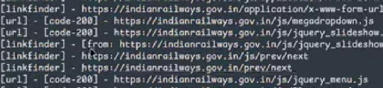
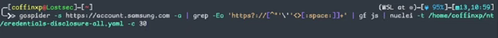

# get all the subdomain for a website that have a certificate


```
curl -s "https://crt.sh/?q=%25.[WEBSITE_DOMAIN]&output=json" \
| jq -r '.[.name_value] \
| sort -u > [DATE].txt
```
- why did we store the result in a file that has the date as his name so we can use `dif` to compare it wit hresult from other days to check if they added a new domains 

- ! it is impotrant to take care that some subdomains have a `*` before them this means that the subdomain have subdomains

- another note that subfinder and sublister uses methods like this to collect subdomains

---

## another way using ASn

1. get the ip of the company `dig -short microsoft.com`
2. get the AS `whois -h whois.cymru.com` * -v [ip-from-previos-step]
3. go to `cloud.projectdiscovery.io` they will give you an API
4. open asnmap and add the API to it and use the tool this tool gives you all the ip's for the company `asnmap -h`
5. Ex of using it is `asnmap -a AS[AS-number-from-step2] -o ASip.txt`
6. `cat ASip.txt | httpx` will give you all working sites on those ip's

--- 

### third way

- just use tools like `subfinder -h` and `dnsx -h`

---

## fourth way -fav icon-

1. go to `favicon-hash-kmsec.uk`
2. give it a domain of microsoft that contains the `fav-icon` click hash from URL
3. take the `favicon_hash` and search shodan
    - take into your account that this gives you all the sites that have the icon and it may be a company that is using hte comapny service 
    - so you have to specify the domain you are searching for `org:"comany name"` EX:- microsoft will be `microsoft limited`

---

# Recon.exe: 403/404 Access, GoSpider, JS Hunting, Stored XSS, Admin Panel & AWS S3 Finds


## what happens if you encountered a 404-403 error page ?

- of course you try to bypass it
    - to do this use the wayback-machine extention

### gospider
- it crawels the websites for subdomains - hidden endpoints - etc
- `gospider -s [domain]`
- the simple output is the type of the data then the link

- to get it in a good format `gospider -s [domain] | grep -oE 'https?://[^[:space:]]+'`
- this regex works by geting the `http` or `https` follwed by `://` then the rest 

- if you only want js files (i don't know why :) `gospider -s [domain] | grep -oE 'https?://[^[:space:]]+' | grep '\.js$ `
- it gets anything that ends with `.js`
    you can then take all the js links and open them by `bulk URL opener` and check them manually (i don't know why :)

- you can use `gospider -s [domain] -a -r ` this passive flag to get 404/403 pages 
- if you have more time use the depth flag to crawel deeper ` gospider -s [domain] -d [number-od-depth]`

- you can use this to search for tokens and API keys
    - not recommended because i am lazy :)



- finally use `find something extention` to find hidden path from the page source

---
# Recon 101

- `sort -u [file] > [file]` to remove duplicates

# TESTING LAYERS
- Open Ports and Services {Default creds on services, service level exploits}  
- Web Hosting Software {Default creds, Web server misconfigurations, web
exploits}
- Application Framework
- Application: Custom Code or COTS
{ ... }
- Application Libraries (usually javascript)
-Integrations

#### the first step
- is tp use nmap to search for open ports then search for known CVE and report
- use wapplayzer to know that services and tools the system uses 
- then look for CVE related to it `Nuclei`

---
# **Reconnaissance (Recon)** 
- in the context of bug bounty hunting and penetration testing,
    - detailing its importance,
    - common pitfalls, 
    - methods,
    - and resources for learning.

### Definition and Importance of Recon

- Recon is defined as the process of **gathering information about the target**. It is crucial because it can help find very critical findings, with successful practitioners often promoting the idea that "Recon is the key".

- **The primary goal of recon is to understand the target application**. This includes using the application to discover features that are not easily accessible by others.

Examples of where recon is essential include:
*   **Understanding the application** and its functions.
*   **Finding an ID** necessary to complete an attack, such as an Insecure Direct Object Reference (IDOR). Methods for finding such IDs include using tools like the **Wayback Machine**, tools that archive URLs, or mapping the application history using tools like Burp Suite.

### The Danger of Over-Automation

A central problem discussed is the tendency for beginners to **over-rely on or overrate automation**. While recon has useful aspects, excessive focus on automation can create problems.

*   **Neglect of Manual Testing:** Beginners may dedicate too much time (sometimes weeks) to mastering automated recon, scripting languages (like Bash, Python, Go, or Rust) to build powerful automation frameworks, causing them to neglect essential **manual testing skills** and potentially forget how to test for common vulnerabilities like **CSRF, SSRF, or XSS**.
*   **False Positives and Duplicates:** Focusing solely on automation, while striving to compete with "Recon dragons" (highly skilled practitioners like Today is New), can lead to frameworks or tools producing a high volume of **false positive or duplicate findings**. This can negatively impact a bug hunter’s profile on platforms like HackerOne or Bugcrowd and hinder job prospects at companies.
*   **Balancing Act:** The source advises that whether a person chooses manual recon or automation, they should be able to simplify the process; however, it stresses that too much recon "for no reason" is detrimental.

### Types of Recon Scopes

Recon scope defines the boundaries of testing and can generally be divided into three types:

1.  **Small Scope:** Focuses on specific, limited targets.
    *   This includes specific URLs, certain paths within a URL, or specific functionalities.
    *   It might involve testing only a single sub-domain, such as `staging`, `development`, `testing`, or `production`.
2.  **Medium Scope (Wildcard):** This is considered common and manageable.
    *   It covers all sub-domains under the main domain (e.g., `*.domain.tld`), including assets like the dashboard, app, or support sub-domains.
    *   **Sub-domain enumeration** is considered an essential part of this type of recon. Tools used here might include running probing tools, `httpx`, `naabu`, or `nmap`.
3.  **Large Scope:** This encompasses everything related to a large organization (similar to programs run by companies like Google, Deloitte, or Indeed).
    *   This scope includes **every asset related to the organization**.
    *   It covers all sub-domains, **ASN numbers**, **CIDR ranges**, and even **subsidiaries** (companies that the main organization has acquired).

### Learning Methodology and Resources

The recommended way to learn recon involves three stages: watching videos, reading sources (write-ups), and practising hands-on.

**Key tools and methods for learning include:**

*   **Establishing a Methodology:** Use existing methodologies (like those provided by certain YouTube channels) that detail both **passive** and **active sub-domain enumeration**.
*   **Using AI for Clarification:** If facing language barriers (especially with English technical terms or blogs), use tools like **ChatGPT**. By taking a screenshot of a concept or command, ChatGPT can be asked to explain it in colloquial language (e.g., explaining `active sub-domain enumeration` or how to install and use a tool like `subfinder`).
*   **Note-Taking with Obsidian:** It is highly recommended to use a tool like **Obsidian** (which uses the **Markdown** language) to organize knowledge. Notes should capture points that remind you of the concept (e.g., definitions of recon or sub-domains), rather than copying entire course transcripts.

**Specific Resources Mentioned:**

*   A **Mind Map** by a person named **Hersh** is recommended for understanding Small Scope Recon.
*   **Jason Haddix's** videos are highly recommended for those wanting to learn how to perform full recon on large companies (Large Scope Recon), covering topics like visualizing assets (using XMind), **Amass**, **SSL certificate scraping**, and **GitHub Dorking**.
*   The channel of **Daoud Youssef** is mentioned as a good resource for understanding terminology and when to apply recon, with content in Arabic.
*   Specific tools mentioned include **Subfinder**, **Assetfinder**, and **massdns** for sub-domain enumeration, and using **W S L** (Windows Subsystem for Linux) for setting up the environment.

Understanding recon is like **studying a map before a treasure hunt**: you need to know the entire territory—the forests, the hidden caves, the main roads (Large Scope), or maybe just a specific clearing where the map says X marks the spot (Small Scope). While modern technology allows for automated aerial scans (automation), relying solely on them means you might miss the subtle clues, footprints, or weak points only visible when you manually walk the terrain (manual testing).
